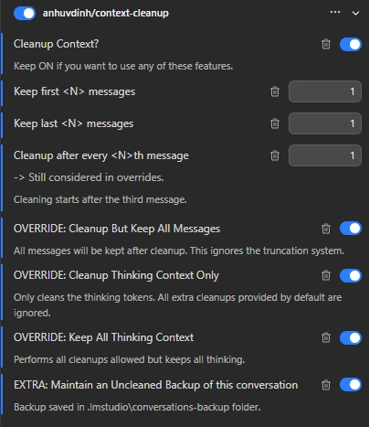

# Context Cleanup Plugin for LM Studio

- **This Plugin** - [GithHub - Context Cleanup](https://github.com/anh-vudinh/LM-Studio_Context-Cleanup) | 

- **Optional Compatible Plugins** (I recommend the Explicit over the Model Dependent version)
[GithHub - Persisting Memories Explicit](https://github.com/anh-vudinh/-anh-vudinh-LM-Studio_Plugin-Persisting-Memories-Explicit) | [LMStudio - Persisting Memories Explicit](https://lmstudio.ai/anhuvdinh/persisting-memories-explicit)

***Model dependent version has not yet been made compatible with the latest version of this plugin. I will update this Readme when it has***
[GithHub - Persisting Memories (Model Dependent)](https://github.com/anh-vudinh/LM-Studio_Plugin-Persisting-Memories) | [LMStudio - Persisting Memories (Model Dependent)](https://lmstudio.ai/anhuvdinh/persisting-memories)

- Tested on Windows 11 Pro 25H2 - LM Studio 0.4.24

## Introduction

The **Context Cleanup** plugin gives users real-time control over trimming the amount of conversation history that stays tied up during a chat session, without them having to manually prune old turns or waiting to hit the threshold where LM Studio determines the context window has become full enough to begin truncation. This plugin accomplishes that by the use of the prompt preprocessor and maintenancing the respective coversation file so only relevant information stays loaded — freeing up portions of the context window that were consumed by irrelevant data to the current turn.

## Table of Contents

- [Introduction](#introduction)
- [Table of Contents](#table-of-contents)
- [Overview](#overview)
- [Setup](#setup)
- [Typical Workflow](#typical-workflow)
- [How It Works](#how-it-works)
- [Technical Details](#technical-details)
- [Limitations or Notes](#limitations-or-notes)

## Overview

Every conversation you have in LM Studio is stored as a `.conversation.json` file. As your chats grow, these files accumulate metadata and older turns that keep getting resent to the model on every message — quietly burning through context window space. This plugin steps in between messages (via the prompt preprocessor hook) to clean those files up behind the scenes.

On each trigger it performs several passes of housekeeping:

- **Truncation** – Keeps a configurable number of the oldest and newest user and assistant messages, discarding everything in between that is no longer needed for an ongoing response. If you wish not to lose an assistant response out of context you have three options, widen the range of your kept messages, override cleanup but keep all messages, use my [GithHub - Persisting Memories Explicit](https://github.com/anh-vudinh/-anh-vudinh-LM-Studio_Plugin-Persisting-Memories-Explicit) to save an assistant's response into a memory seed which you then can inject back into the conversation for the assistant to reference. You would not visually see the memory seed injected into chat unless you spcifically ask the assistant to read the memory back out to you. Which technically would be just wasting tokens doubling up the memory living in context.
- **Thinking cleanup** – Removes previously generated thinking steps from assistant messages so reasoning tokens aren't re-sent forever. Last assistant thinking is excluded and preserved.
- **Field cleaning** – Blanks or strips leftover Jinja templates, prediction system prompts, past prediction tools, and preprocessed content blocks that are irrelevant after a turn has finished.
- **Metadata preservation** – Carries over critical information such as the Internal Chat ID (`ICID`) any memory seeds from companion plugins [GithHub - Persisting Memories Explicit](https://github.com/anh-vudinh/-anh-vudinh-LM-Studio_Plugin-Persisting-Memories-Explicit), and Formatting Instructions - the message number append from the Model Dependent version of PM, and keeps working correctly across cleanup cycles.

- In addition to active cleaning, the plugin can optionally maintain a backup of your conversation before cleanup if enabled.
- There are additional setting overrides I believe specific users would find useful.

## Setup

From LM Studio Website: Install from the LM Studio Hub then enable the plugin.

From GitHub Source Code: Open PowerShell/terminal, navigate to root folder of the plugin you downloaded where you see the README, package, and manifest. Enter in `lms dev -i -y` . Plugin should now be available in LM Studio.

Make sure the **`Cleanup Conxtext?`** is enabled along side the plugin being enabled for cleanup functionality (this is mandatory — if it's off cleanup won't run at all).

Choose the options you want. The plugin will start to work immediately after you've sent a message. Three turns must exist before the plugin begins to clean. The OVERRIDES take precedence over the default plugin's workflow.

## Typical Workflow

1. **Enable the plugin** in LM Studio's plugin control panel.
2. **Configure your options** using the control panel — decide how many oldest/newest turns to keep and how often cleanup should run (see [How It Works](#how-it-works)).
3. **Have a conversation as usual.** Each new user message is added to history exactly like normal; you won't notice any difference on your end.
4. **Let the plugin do its work automatically.** Mandatory 2 second grace period needed immediately after the assistant finishes it's response for cleanup to occur. Once the trigger conditions are met, it cleans up and maintains the current conversation file behind the scenes.
5. **(Optional) Enable backup mode** to keep an uncleaned copy of your conversations for reference or recovery. If you enable this mid conversation, the ***first moment*** at which you turned it on will be the foundation of your backup's data. Leave this toggled on if you wish for the model to keep updating that respective backup file. The moment you turn it off, the newest message turn will stop being appended.

## How It Works

The table below outlines every available configuration in the control panel and explains what each one does:

| Control Panel Option | Type | Purpose |
| :--- | :--- | :--- |
| **Cleanup Context?** | Boolean · `ON / OFF` | Master switch that turns all cleanup behavior on or off. The plugin only functions while this is enabled. |
| **Keep first `<N>` messages** | Numeric, min 1 | Number of oldest user/assistant turns to preserve from the beginning of the conversation. Message 1 will never be an option to remove. |
| **Keep last `<N>` messages** | Numeric, min 1 | Number of newest user/assistant turns to keep. |
| **Cleanup after every `<N>`th message** | Numeric, min 1 | Trigger rate of cleanup after the `<N>`th message from the last cleanup. Cleaning only begins once at least three existing messages are present (the current turn counts toward this). Still respected by the override modes below. |
| **OVERRIDE: Cleanup But Keep All Messages** | Boolean · `ON / OFF` | When enabled, internal cleaning still allowed to run but no turns are truncated — everything is retained in context. Overrides the keep-oldest / keep-newest counts system. |
| **OVERRIDE: Cleanup Thinking Context Only** | Boolean · `ON / OFF` | Restricts cleanup to thinking tokens only; all other default cleanups past (system prompt, Jinja templates, tools, preprocessed content) are ignored. |
| **OVERRIDE: Keep All Thinking Context** | Boolean · `ON / OFF` | Disables thinking cleanup. All thinking will remain. Other cleanups allowed. |
| **EXTRA: Maintain an Uncleaned Backup** | Boolean · `ON / OFF` | Keeps a backup copy of the conversation in `.lmstudio\conversations-backup`. The first time it is enabled, an exact 1-to-1 copy is saved; afterward only the latest user + assistant turns are appended to upkeep the current state. |

**Multiple OVERRIDES are allowed to be enabled at the same time**
Cleanup But Keep All Messages + Cleanup Thinking Context Only + Keep All Thinking Context = All messages and thinking kept, no other cleaning occurs.

Cleanup But Keep All Messages + Cleanup Thinking Context Only = All messages kept, only thinking is cleaned up.

Cleanup But Keep All Messages + Keep All Thinking Context = All messages kept, everything other than thinking is cleaned up.

Cleanup Thinking Context Only + Keep All Thinking Context = No cleanups are performed. They cancel each other out. CTCO tries to clean up thinking and save the rest. KATC tries to clean up the rest but keep thinking. Neither allows the other to operate.

## Technical Details

The plugin relies on LM Studio's local storage layout and manages a few files/folders automatically as part of its operation:

| Path / File | Role in Cleanup |
| :--- | :--- |
| **USER MESSAGE 1** | The first user's message will be used to house meta data from my [GithHub - Persisting Memories Explicit](https://github.com/anh-vudinh/-anh-vudinh-LM-Studio_Plugin-Persisting-Memories-Explicit) Plugin. This includes the ICID, Memories the user Injects, and Formatting Instructions. The user can freely delete the user's message 1, there is built in recovery so nothing will break. This is just to inform you, nothing is required of you. |
| `~/.lmstudio/conversations/` | The default main directory that LM Studio stores current chat sessions. This is where the plugin reads, cleans up, and maintains conversation files. |
| `ChatSessionConversationRelationship.json` *(inside `/conversations`)* | Automatically created and used by this plugin. Tracks the mapping between an Internal Chat ID (`ICID`) and its matching conversation file so the plugin can reliably and cheaply locate the correct session across restarts or random uncontrollable plugin reinitializations. Hard cap of only 15 of the latest entries to keep file size small. |
| `<conversationFile>.lock` *(temporarily inside `/conversations`)* | A temporary lock file created while cleanup is in progress and removed when finished. It lets this plugin safely run alongside others, like my (e.g., *Persisting Memories*) plugin, that may want to modify the conversation at the same time. |
| `~/.lmstudio/conversations-backup/` *(only if createBackup is enabled)* | Holds uncleaned backup copies of your conversation. The first time it's enable it creates an exact copy; subsequent runs append only the latest uncleaned user/assistant turns to update the current state without constantly overwriting with a cleaned conversation and losing older chats. Old backups file's whose names are reused for a new conversation will be renamed with the current time's UNIX timestamp as a suffix. The most recent conversation has priority over the duplicated base file name. |
| `<conversationFile>.persisting-memories-final-action.ready` *(temporarily inside `/conversations`)* | Created by my Persisting Memories Plugin to coordinate with the Context Cleanup plugin to allow Persisting Memories to execute it's actions first. PM is the creator of the .ready, CC does the cleanup. |

## Limitations or Notes

- Just like my persisting memories plugin, this plugin also must respect the 2 second time window after the assistant has finished it's response, before any modifications to the conversation file / chat session sticks and doesn't get overwritten by a cached version. This 2 second window is very short and users will not even notice it pass, users should not need to intentionally hold back their normal flow. If the chat is engaged with during that 2 second window, it's very little drawback, the cleaning will just commence on the next time it triggers.
- Unfortuntely this is the best I can do with the limited functionality granted by LM Studio and the quirks/oddities of their program's flow, but the options are robust enough to give users the control they lack over their context being tied up and accumulating over irrelevant past tokens. I targeted the biggest context wasters without compromising the underlying structure of the conversation. There are some fields still available to be cleaned but I think that would be overly aggressive for little return.
- This plugin is also recommended to run with my persiting-memory plugin because it can help clean up some artifacts used to run that plugin, like renumbering message #s, relocating some metadata to the first user's message so there's less resources used in iterating through the conversation file.
- The plugin will not have the ability to delete the user's first message, but that does not prevent the user from deleting it using LM Studio's standard "delete this message" button tied to each chat bubble. I've gone ahead and added the ability for the plugin to repopulate that metadata on its own in the user's new "first message". I've covered many failure points and it's recovery from those failures. The plugin is resilient, just do what you wish to do how you wish to do it. The only thing you have to respect is the 2 second time window after the assistant's finished response. That's not on me, that's on LM Studio and I have no way around it, I can only ensure nothing breaks depending on what you do.